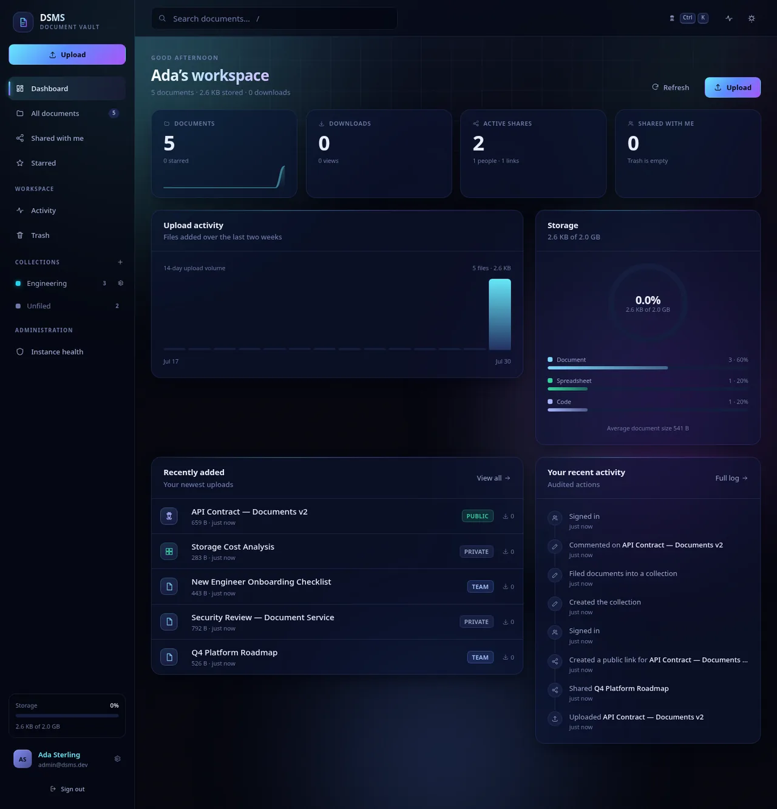
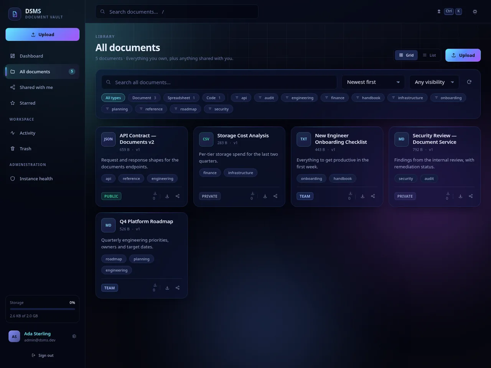
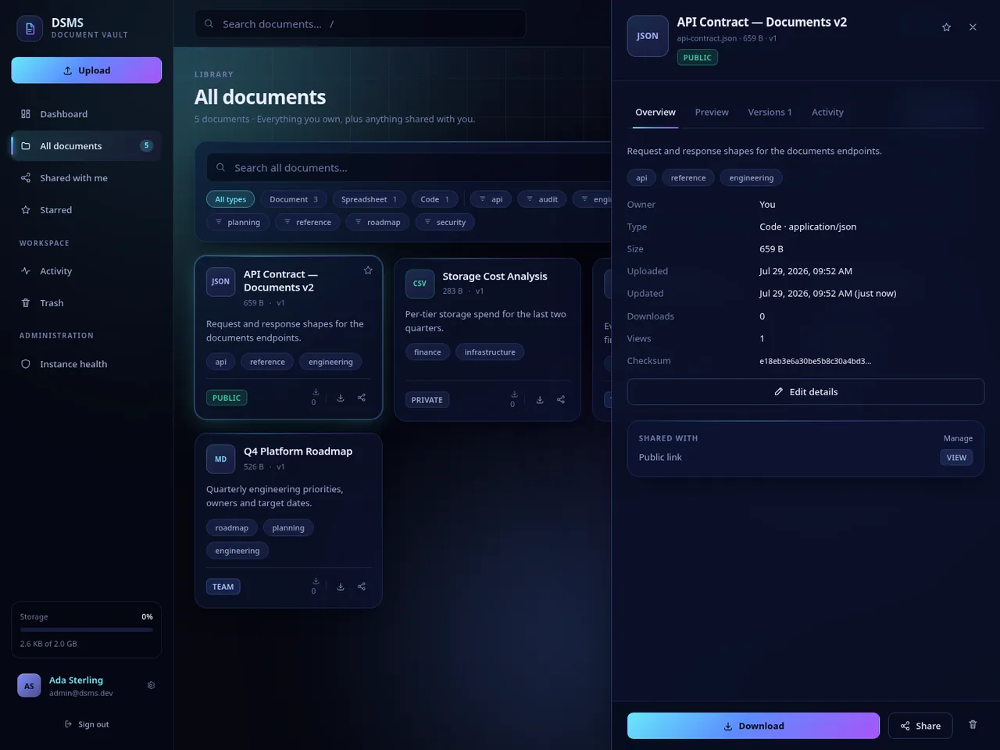
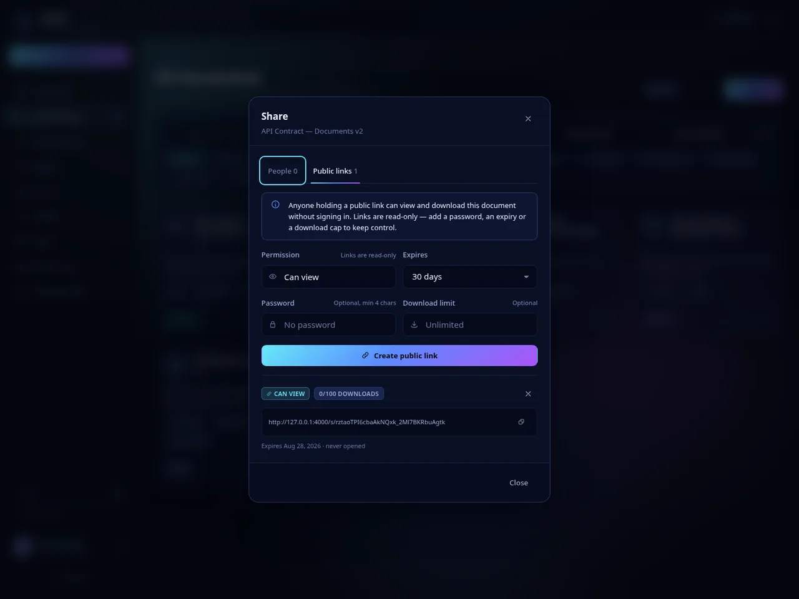
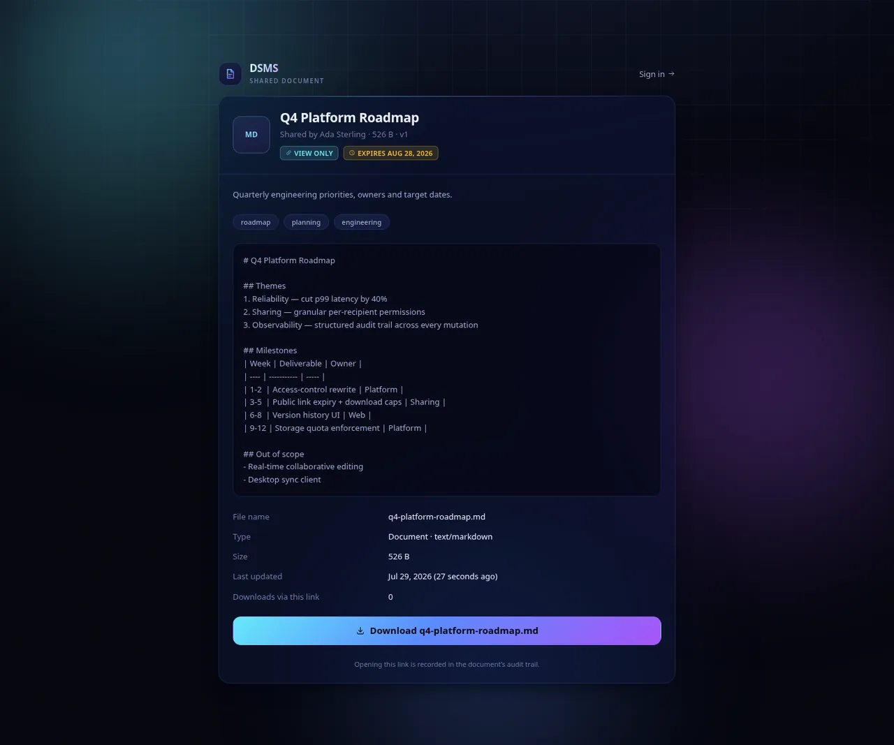
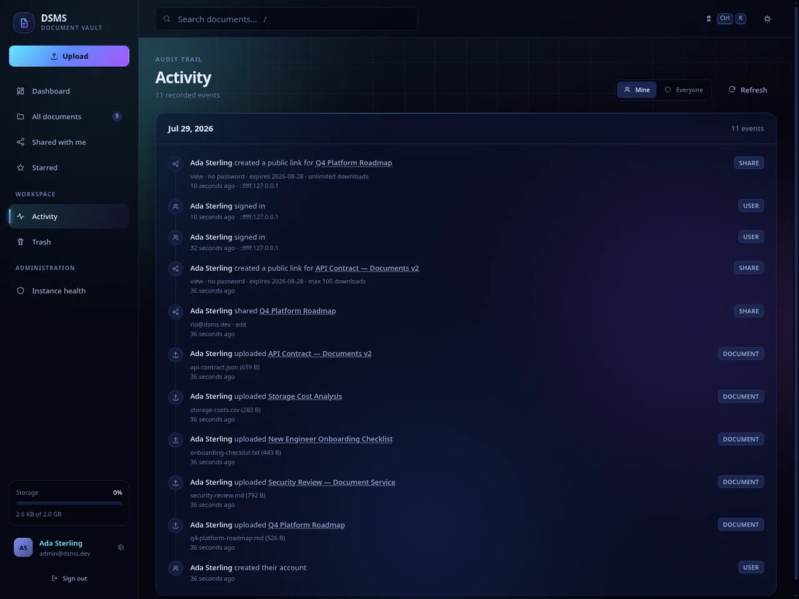
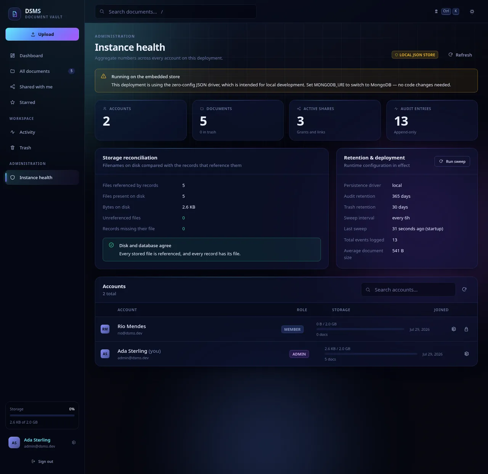
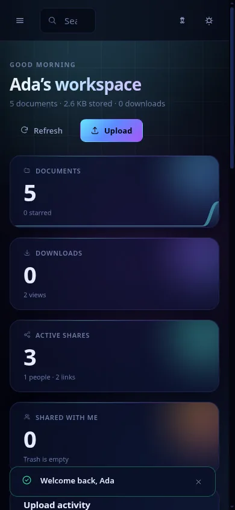

# Document Sharing & Management System

A document vault with real authorization: upload and version files, share them with named
people or through revocable public links, and audit every action. Express/MongoDB API,
React dashboard.



## Run it

Needs **Node 18.17+** and nothing else — no database to install, no `.env` to write.

Every command below is a single line, so it pastes cleanly into PowerShell, cmd, bash and zsh alike.

```sh
git clone -b rebuild/full-stack-document-vault https://github.com/harshvardhan8058/document-sharing-management-system.git
cd document-sharing-management-system
npm run setup
npm run seed
npm start
```

| Step | What it does |
| --- | --- |
| `npm run setup` | Installs the server and client dependencies, then builds the interface. Takes a minute or two the first time. |
| `npm run seed` | Optional. Creates the demo accounts and five sample documents. |
| `npm start` | Serves the API and the built interface on **http://localhost:4000**. |

Sign in with **`admin@dsms.dev`** / **`Admin@12345`** (admin) or `rio@dsms.dev` / `Member@12345`
(member) to see sharing from the recipient's side. Without seeding, the first account you register
becomes the admin.

Working on the interface? `npm run client:dev` gives you Vite with hot reload on `:5173`, proxying
the API to `:4000` (keep `npm run dev` running in another terminal).

<details>
<summary><strong>If something goes wrong</strong></summary>

**`npm error Missing script: "setup"`** — you are in the wrong directory. `npm` is reading a folder
with no `package.json`. Check that `git clone` actually succeeded and that you have `cd`'d *into*
`document-sharing-management-system`. `dir` (or `ls`) should show `package.json`, `server` and `client`.

**`fatal: repository '\' does not exist`** — a `\` at the end of a line is a bash line-continuation
and PowerShell does not understand it. Paste the clone command as one line.

**`'git' is not recognized`** — install [Git](https://git-scm.com/downloads), then reopen the terminal.

**Port 4000 already in use** — start it on another port:
`$env:PORT=4100; npm start` in PowerShell, or `PORT=4100 npm start` in bash.

**Check your Node version** with `node -v`. It must be 18.17 or newer; 20 or 22 is ideal.

</details>

Point it at a real database whenever you want — set `MONGODB_URI` and restart. Nothing else changes.
See [Persistence](#persistence).

---

## What it looks like

| | |
| --- | --- |
| **Sign in**<br> | **Library**<br> |
| **Document detail** — preview, versions, audit trail<br> | **Sharing** — links with password, expiry, download cap<br> |
| **Public link**, opened with no account<br> | **Audit trail** — who, when, from where<br> |
| **Instance health** — accounts, quotas, disk reconciliation<br> | **Mobile**<br> |

---

## What it does

| Area | Behaviour |
| --- | --- |
| **Accounts** | Registration, sign-in, profile, password rotation. JWT bearer tokens, scrypt password hashing. |
| **Documents** | Upload with size, extension **and content** limits, metadata, tags, three visibility levels. |
| **Versions** | Uploading a revision never overwrites history; any earlier version stays downloadable. |
| **Sharing — people** | Grant `view` / `edit` / `manage` by email, with an optional expiry. Works before the recipient has an account. |
| **Sharing — links** | Read-only anonymous links with optional password, expiry date and hard download cap. Revocable. |
| **Quotas** | A per-account allowance, enforced on upload, counting every stored version and anything sitting in the trash. |
| **Trash** | Soft delete, restore, or permanent delete that also erases every stored version from disk. Auto-purged after a retention window. |
| **Sessions** | Tokens can be revoked: "sign out everywhere", and changing a password ends every other session. |
| **Audit trail** | Append-only log of uploads, downloads, edits, shares, revocations and sign-ins, with actor, timestamp and IP. Pruned on a retention window. |
| **Administration** | Account list with real storage footprint, role and quota changes, deactivation, disk/database reconciliation. |
| **Insights** | Dashboard metrics, storage gauge, type breakdown, upload timeline, per-instance health for admins. |

### The interface

Dark "Nebula" theme by default with a light "Daybreak" alternative, glassmorphism panels over an
animated aurora backdrop. Grid and list layouts, drag-and-drop upload anywhere on the page with
per-file progress, a document detail drawer with inline preview (images, PDF, text), a
`Ctrl/⌘ K` command palette, faceted filtering, and toast notifications.

Keyboard: `⌘/Ctrl K` command palette · `/` focus search · `U` upload · `Esc` close.

---

## Persistence

The API speaks to a repository interface with two interchangeable drivers.

| `DB_DRIVER` | Behaviour |
| --- | --- |
| `auto` *(default)* | `mongo` when `MONGODB_URI` is set, otherwise `local`. |
| `mongo` | MongoDB via Mongoose. Requires `MONGODB_URI`. |
| `local` | Dependency-free JSON store under `./data`. Zero setup. |

The local driver exists so `npm start` works on a machine with nothing installed — useful for
development, demos and CI. It is **not** intended for production; point `MONGODB_URI` at a real
cluster and nothing else changes.

Both drivers return byte-identical documents. Ids are app-generated 24-character hex strings and
timestamps are ISO strings on both sides, so switching drivers never changes an API response.

---

## Configuration

Copy `.env.example` to `.env`. Every value has a working default.

| Variable | Default | Notes |
| --- | --- | --- |
| `PORT` | `4000` | |
| `NODE_ENV` | `development` | `production` requires an explicit `JWT_SECRET`. |
| `CORS_ORIGIN` | `*` | Comma-separated allow-list. Same-origin is always permitted. |
| `DB_DRIVER` | `auto` | `auto` · `mongo` · `local` |
| `MONGODB_URI` | — | Enables the mongo driver. |
| `LOCAL_DB_DIR` | `./data` | Local driver storage. |
| `JWT_SECRET` | random per boot | **Set this in production.** Without it, tokens die on restart. |
| `JWT_EXPIRES_IN` | `7d` | |
| `PASSWORD_COST` | `16384` | scrypt `N`. |
| `UPLOAD_DIR` | `./uploads` | |
| `MAX_UPLOAD_MB` | `25` | |
| `STORAGE_QUOTA_GB` | `2` | Per-account allowance. `0` disables the limit. |
| `ALLOWED_EXTENSIONS` | see `.env.example` | Empty means "allow anything". |
| `TRUST_PROXY` | `false` | **Leave off unless a proxy really is in front.** See below. |
| `RATE_LIMIT_MAX` | `600` / 15 min | Downloads and previews are exempt. |
| `AUTH_RATE_LIMIT_MAX` | `40` / 15 min | Credential endpoints only. |
| `ACTIVITY_RETENTION_DAYS` | `365` | Audit entries older than this are deleted. `0` disables. |
| `TRASH_RETENTION_DAYS` | `30` | Trashed documents are purged after this. `0` disables. |
| `MAINTENANCE_INTERVAL_HOURS` | `6` | Retention sweep cadence. `0` = manual only. |

### A note on `TRUST_PROXY`

With proxy trust enabled, Express believes the `X-Forwarded-For` header — and the rate limiter
buckets requests by it. On a directly exposed server that means a client can forge its own IP and
mint a fresh login-attempt budget on every request, defeating the 40-attempt limit. So it defaults
to `false`. Set it to `1` behind a single reverse proxy, to a comma-separated list of proxy
addresses, or to `true` only if you accept that trade-off (the server warns at boot if you do).

Generate a secret:

```bash
node -e "console.log(require('crypto').randomBytes(48).toString('hex'))"
```

---

## Layout

```
server/
  index.js            entry — connects the database and creates the upload dir before listening
  app.js              express app factory: helmet/CSP, CORS, rate limits, static client, SPA fallback
  config/env.js       all configuration resolved and validated exactly once
  data/               persistence
    filter.js         shared query dialect used by both drivers
    local/            file-backed store (atomic writes, coalesced flushes)
    mongoose/         schemas + repository adapter
  services/           all business logic
    access.service.js the single authority on "who may do what to this document"
  controllers/        thin HTTP translation over the services
  routes/             routing + express-validator chains
  middleware/         auth, upload, validation, request log, error handler
  utils/              ApiError, tokens, password hashing, file helpers, pagination
client/
  src/lib/            api client, router, formatters, icon set
  src/context/        theme, toasts, auth session, workspace state
  src/components/     design-system primitives and feature components
  src/pages/          one file per route
  src/styles/         design tokens, base, layout, components, utilities
scripts/
  seed.js             demo data
  verify-api.js       end-to-end API verification (both drivers)
tests/                node:test unit tests — no test framework dependency
.github/workflows/
  ci.yml              tests on Node 20/22, the API suite on both drivers, client build
```

Authorization lives in exactly one place, `server/services/access.service.js`. Permission levels are
ordered `view < edit < manage < owner`; an owner outranks an admin, an admin gets `manage` for
moderation, and an explicit share outranks the document's visibility setting. A caller who may not
even read a document gets `404`, not `403`, so the API cannot be used to discover which ids exist.

---

## Scripts

```bash
npm start            # serve API + built client
npm run dev          # API with --watch
npm run client:dev   # Vite dev server on :5173, proxying /api to :4000
npm run build        # install + build the client
npm run seed         # demo accounts and documents (safe to re-run)
npm test             # unit tests (node:test, no test framework dependency)
npm run verify       # 111-check end-to-end API suite against a throwaway database
npm run check        # both of the above
```

`npm run verify` boots the real server in-process against an isolated database and upload
directory, exercises every endpoint over HTTP — including the failure paths — and exits non-zero on
the first failure.

**Run the same suite against a real MongoDB.** The harness redirects to a throwaway database
(`dsms_verify_<pid>`) and drops it afterwards, so this is safe to point at any cluster:

```bash
DB_DRIVER=mongo MONGODB_URI=mongodb://127.0.0.1:27017 npm run verify
```

Both driver paths are exercised in CI, and both currently pass 111/111.

`npm test` covers the parts where a subtle mistake is expensive and invisible: the query dialect
the two drivers share, scrypt hashing, magic-byte inspection, the compare-and-swap primitive behind
download caps, the local store's lock and durability, and the open-redirect defence in the router.
Two of those files exist specifically to catch drift between the client and server copies of the
password policy and the file-type table.

---

## API

Bearer token in `Authorization`. Errors are always `{ "error": { "code", "message", "details?" } }`.
`GET /api` returns a live index of every route.

### Auth
| | |
| --- | --- |
| `POST /api/auth/register` | Create an account. First account becomes admin. |
| `POST /api/auth/login` | Exchange credentials for a token. |
| `GET  /api/auth/me` | Current user. |
| `PATCH /api/auth/me` | Update name / accent colour. |
| `POST /api/auth/change-password` | Rotate password. |
| `POST /api/auth/logout-all` | Invalidate every token for the account, this one included. |
| `GET  /api/auth/directory?search=` | People picker for sharing. |
| `GET  /api/auth/me/activity` | Your audit trail. |

Changing a password ends every *other* session and returns a freshly signed token, so the browser
you are sitting at stays signed in. A token rejected this way reports `TOKEN_REVOKED`.

### Documents
| | |
| --- | --- |
| `GET  /api/documents` | `scope=all\|mine\|shared\|starred\|trash`, `search`, `category`, `tag`, `visibility`, `sort`, `page`, `limit`. Returns `{ documents, meta, facets }`. |
| `POST /api/documents` | `multipart/form-data`: `file`, `title`, `description`, `tags`, `visibility`. |
| `GET  /api/documents/tags` | Distinct tags you can see. |
| `GET  /api/documents/:id` | Detail with versions, shares and activity. |
| `PATCH /api/documents/:id` | Update metadata. Visibility requires `manage`. |
| `POST /api/documents/:id/versions` | Upload a new version. |
| `GET  /api/documents/:id/download?version=` | Download. |
| `GET  /api/documents/:id/preview` | Inline preview. |
| `PUT\|DELETE /api/documents/:id/star` | Star / unstar (per user). |
| `POST /api/documents/:id/trash` · `/restore` | Soft delete and restore. |
| `DELETE /api/documents/:id?permanent=true` | Erase the record and every stored version. |
| `DELETE /api/documents/trash/empty` | Empty your trash. |

### Sharing
| | |
| --- | --- |
| `GET  /api/documents/:id/shares` | List grants (requires `manage`). |
| `POST /api/documents/:id/shares` | `{ email, permission, expiresInDays? }`. |
| `POST /api/documents/:id/links` | `{ permission, password?, expiresInDays?, maxDownloads? }`. |
| `DELETE /api/documents/:id/shares/:shareId` | Revoke a grant or link. |
| `GET  /api/share/:token` | **Public.** View. Password via `x-share-password`. |
| `GET  /api/share/:token/download` · `/preview` | **Public.** |

Link failures carry distinct codes so a client can explain itself: `LINK_NOT_FOUND`,
`LINK_REVOKED`, `LINK_EXPIRED`, `LINK_EXHAUSTED`, `LINK_PASSWORD_REQUIRED`, `LINK_PASSWORD_INVALID`.

### Insights
| | |
| --- | --- |
| `GET /api/stats/overview?days=` | Dashboard metrics. |
| `GET /api/stats/activity` | Instance-wide audit feed *(admin)*. |
| `GET /api/stats/system` | Instance health and storage reconciliation *(admin)*. |
| `GET /api/health` | Liveness probe. |

### Administration *(admin only)*
| | |
| --- | --- |
| `GET  /api/admin/users` | Accounts with their real storage footprint. |
| `PATCH /api/admin/users/:id` | `{ role, isActive, storageQuotaGb }`. Deactivating signs the user out everywhere. |
| `GET  /api/admin/storage` | Compare files on disk against the records that reference them. |
| `POST /api/admin/storage/purge-orphans` | Delete unreferenced files. |
| `POST /api/admin/maintenance/run` | Run the retention sweeps now. |

Two invariants are enforced here rather than left to the UI: you cannot deactivate your own
account, and a change that would leave the instance with no active admin is refused
(`LAST_ADMIN`). Stepping down is allowed as soon as a second active admin exists.

---

## What was wrong before

The previous revision did not start. `node app.js` threw `MODULE_NOT_FOUND` because
`controllers/documentcontroller.js` was required as `documentController` and the model file had no
`.js` extension at all — both fatal on a case-sensitive filesystem.

Behind that:

- **No authorization.** The `authenticate` middleware was `if (req.body) next()`, which is truthy
  for every request. Any caller could read, edit or delete any document.
- **Uploads could never succeed.** The schema required `content`, `documentType` and `creatorId`;
  the upload handler set `title`, `description` and `file`. Every save failed validation.
- **`getDocuments` returned the string `"documents"`** instead of the query result.
- **Downloads read from `/path/to/documents/`**, a placeholder that never existed, and concatenated
  a stored name into it — path traversal by construction.
- **`uploads/` was never created**, so multer's first write would have thrown `ENOENT`.
- **`db.js` logged `MONGODB_URI` but connected with `DB_CONNECTION_STRING`**, and passed driver
  options removed years ago.
- **No upload limits** of any kind — size or type.
- **A request failing after multer wrote its file left that file on disk forever.**
- **Inverted HTTP verbs**: `PUT /upload` created, `POST /:id` updated. No `GET /:id`, no `DELETE`,
  no download route.
- **`middleware/upload.js` had two `module.exports`**; the first was dead code. The error handler it
  exported was never registered, so every failure surfaced as `500 "Something broke!"` in plain text.
- **`node_modules/` was committed** to the repository.
- **No frontend.**

All of the above are fixed and covered by `npm run verify`.

Five further bugs were found by driving the built app in a real browser, and are worth recording
because none of them show up in a unit test:

1. **CORS rejected the app's own origin.** Vite's build emits `crossorigin` on its asset tags, which
   makes the browser send an `Origin` header on *same-origin* asset requests too. Matching those
   against the allow-list meant every script and stylesheet 500'd and the page rendered blank.
   Same-origin is now always allowed, and a disallowed origin gets no CORS headers rather than an error.
2. **Storage quota reported `0 B`.** The Mongoose schema declared a default; the local driver has no
   schema, so the field was simply absent. The quota is now configuration, set explicitly at
   creation, and identical under both drivers.
3. **Two themes in one session.** The theme hook only ran inside the app shell, so the sign-in
   screen rendered dark and the dashboard light. Theme is now resolved once at the root.
4. **Text documents opened through a public link showed "no preview".** The anonymous path fetched a
   blob but only had renderers for images and PDFs.
5. **Truncated labels overlapped.** `text-overflow: ellipsis` is a no-op on inline elements, which
   the sidebar user block and dashboard rows were.

### Then a second audit found more

A deliberate pass over the "finished" code turned up three genuine defects, each reproduced before
being fixed and now pinned by a regression check:

1. **`scope=starred` leaked documents whose access had been revoked.** Every other listing scope was
   constrained to what the caller may see; this one filtered only on the bookmark. Starring an
   `internal` document and then having the owner make it `private` left its title, filename, owner
   and size visible indefinitely. The file itself was never exposed. Access rules now live in one
   `accessibleClause()` that every scope intersects with.
2. **A public link's download cap could be exceeded.** The counter was a read-modify-write, so
   concurrent downloads overwrote each other (ten parallel requests recorded three), and the limit
   check and the increment were separate steps, so several requests passed the check before any of
   them incremented. Downloads are now claimed with a compare-and-swap *before* streaming. The
   deliberate trade-off: an aborted transfer still spends its slot, so the cap fails closed.
3. **The storage quota was decoration.** It appeared in the sidebar, the dashboard gauge and the
   settings page, and nothing ever checked it. It is now enforced on upload and on new versions, and
   the number shown is computed the same way the check is — including version history and trash.

Alongside those: the `LAST_ADMIN` guard was unreachable dead code *and* wrongly blocked demoting an
already-inactive admin; a public link would accept `permission: "edit"` and report it back despite
no anonymous write path existing; the admin "unreferenced files" figure was a subtraction that
counted every historical version as an orphan.

Three more surfaced while writing the tests — a client password rule missing the server's
200-character maximum, `sanitizeFilename` leaving Windows-style paths intact on Linux, and a focus
trap that captured its container element once and so pointed at a detached node after the panel
finished loading, silently swallowing every Tab press.

---

## Notes on a few decisions

**scrypt instead of bcrypt.** Node ships scrypt, so there is no native addon to compile — the most
common reason a password hash breaks a container build.

**No routing library.** The client needs nine routes with one dynamic segment each. Every published
React Router line currently carries an open advisory, one of them an open redirect through
`<Link>`/`navigate()`. `client/src/lib/router.jsx` is ~150 lines and its `normalizeTo()` rejects
absolute, scheme-relative and backslash destinations outright. The client has no runtime
dependencies beyond React itself.

**Permissions are sent to the client, not inferred by it.** Every document carries a `permissions`
object from the server, and the UI renders its buttons from that — so the interface and the API can
never disagree about what is allowed.

**The audit trail survives deletion.** Removing a document erases its files and its shares but keeps
its log entries. An audit trail that can be erased by the person being audited is not an audit trail.

**Uploads are judged by their bytes, not their name.** An extension allow-list only reads a string
the client chose. `server/utils/signatures.js` reads the leading bytes: executables are refused under
any name, and an extension that claims a specific binary format has to actually be that format.
Formats with no reliable signature — plain text, CSV, JSON, SVG — are exempt, because guessing there
would only reject valid files.

**Defaults are chosen to fail safe.** `TRUST_PROXY` is off, retention sweeps are on, and the server
refuses to start in production without an explicit `JWT_SECRET`. Configuration you have to remember
to harden is configuration that ships unhardened.

---

## Known limitations

Deliberate gaps, so nobody has to discover them the hard way.

**Tokens live in `localStorage`.** That makes them readable by any successful XSS. The mitigations
are a strict CSP with no inline scripts, and the revocation support above. Moving to an
`httpOnly` cookie would be stronger, and would mean adding CSRF protection to every mutating
route — a deliberate deferral, not an oversight.

**Rate limiting is in-process memory.** It resets on restart and each replica keeps its own budget,
so it slows down a single attacker rather than a distributed one. A shared store (Redis) is the
real answer behind more than one instance.

**No outbound email.** Sharing with an address that has no account works — access starts the moment
they register, and pending grants are linked to the new account automatically — but nobody is
*notified*. For the same reason there is no password-reset flow; an admin changing a quota or role
is the only out-of-band recovery path.

**The local driver is single-process.** It keeps every record in memory, scans linearly, and rewrites
whole files. A pid lock makes a second process refuse to start rather than silently corrupt the
data. It is meant for development, demos and CI — not production.

**No component-level frontend tests.** The pure logic in `client/src/lib` is unit tested and the full
interface has been driven end to end in a real headless browser, but there is no jsdom render suite,
so a purely visual regression would not be caught automatically.

**Virus scanning is out of scope.** Content inspection stops disguised executables; it is not a
malware scanner. Anything handling untrusted uploads at scale wants a real scanner in front.
